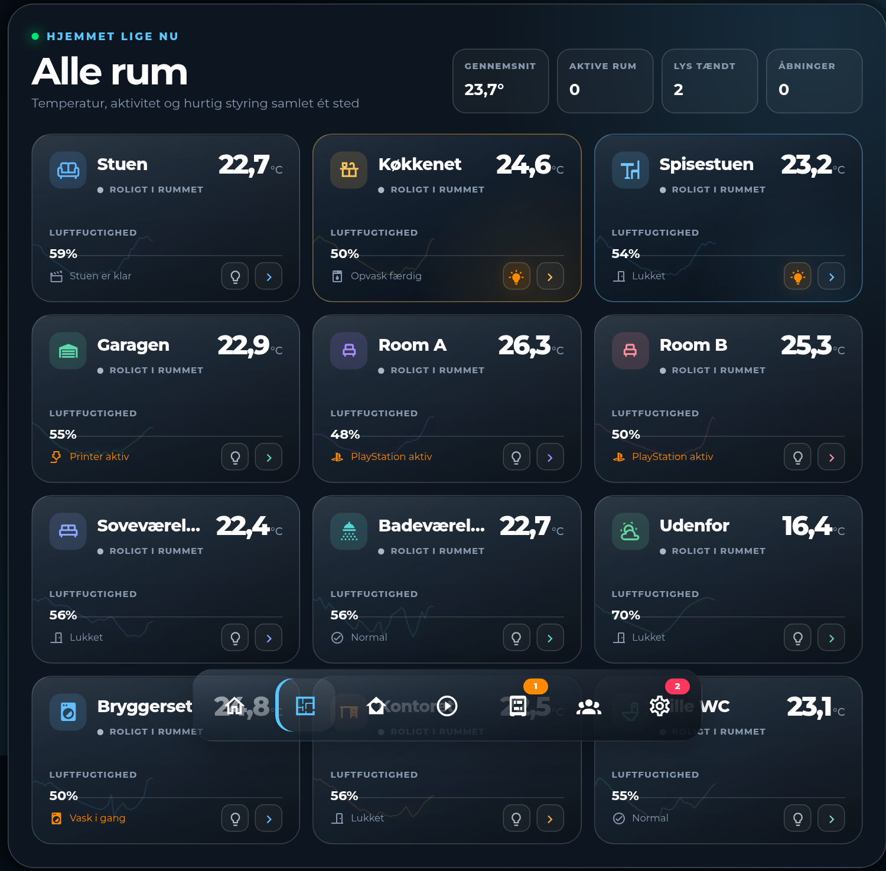

# HA Home Room Overview Card



A Home Assistant Lovelace card that shows every room in the house as a tile:
current temperature with a faint 24-hour sparkline behind it, humidity,
presence, an open-window/door or custom alert flag, and a one-tap light
toggle — plus a summary strip (average temperature, active rooms, lights
on, open sensors) across the top.

Tapping a room tile navigates to a configured dashboard path or popup
(handy paired with a per-room detail view or a popup card like
[bubble-card](https://github.com/Clooos/Bubble-Card)).

Plain JavaScript, no build step — copy the file in and register it as a
dashboard resource.

> **Note:** the card's on-screen labels are currently Danish only. There's
> no built-in translation layer yet — fork the file and edit the label
> strings directly if you need another language. Colors and surfaces use
> this repo's own CSS variables (`--dashboard-accent`, `--surface`, etc.)
> with sensible built-in fallbacks, so the card looks right out of the box —
> but if your dashboard theme already defines those variable names for
> something else, override them or rename as needed.

## Installation

### HACS (custom repository)

1. In HACS, go to **Frontend** → the three-dot menu → **Custom repositories**.
2. Add `https://github.com/MRDonnii/ha-home-room-overview-card` as type
   **Dashboard**.
3. Install **HA Home Room Overview Card** and add the resource if HACS
   doesn't do it automatically.

### Manual

1. Download `ha-home-room-overview-card.js` from the latest release (or
   this repo).
2. Copy it to
   `config/www/community/ha-home-room-overview-card/ha-home-room-overview-card.js`.
3. Add it as a dashboard resource:
   ```yaml
   url: /local/community/ha-home-room-overview-card/ha-home-room-overview-card.js
   type: module
   ```

## Usage

Add the card via the dashboard editor (search for "Home Room Overview") or
in YAML:

```yaml
type: custom:ha-home-room-overview-card
title: All rooms
rooms:
  - name: Living room
    icon: mdi:sofa
    temperature: sensor.living_room_temperature
    humidity: sensor.living_room_humidity
    light: light.living_room
    presence: binary_sensor.living_room_presence
    popup: /lovelace-home/living-room
  - name: Garage
    icon: mdi:garage
    temperature: sensor.garage_temperature
    opening: binary_sensor.garage_door
    popup: /lovelace-home/garage
    outdoor: false
  - name: Terrace
    icon: mdi:weather-sunny
    temperature: sensor.outdoor_temperature
    popup: /lovelace-home/terrace
    outdoor: true
```

Only `name` is required per room. Every measurement field is optional and
simply left blank on the tile when not configured.

## Configuration reference

| Key | Description |
|---|---|
| `title` | Card header text (default `Alle rum`) |
| `rooms` | List of room objects, see below |

### Room object

| Key | Description |
|---|---|
| `name` | Room label (required) |
| `icon` | MDI icon for the room tile |
| `accent` | CSS color for this room's tile accent (default: the card's `--dashboard-accent`) |
| `temperature` | Sensor — current reading, and the 24h sparkline behind it |
| `humidity` | Sensor — shown as a secondary reading |
| `light` | `light` entity — adds a tap-to-toggle button and highlights the tile when on |
| `presence` | `binary_sensor` (or any entity with an "active" state like `on`/`home`) — drives the presence dot and status line |
| `opening` | `binary_sensor` — an open window/door is flagged in the tile's footer |
| `alert` | `{entity, active, idle, icon}` — a custom status line shown instead of the opening/normal text, with different copy for the active/idle state |
| `popup` | Dashboard path or `#hash` to navigate to when the tile is tapped |
| `outdoor` | Set `true` to exclude this room from the house-average temperature calculation |

## License

MIT — see [LICENSE](LICENSE).
The visual card editor provides entity pickers and add/remove controls for rooms.
